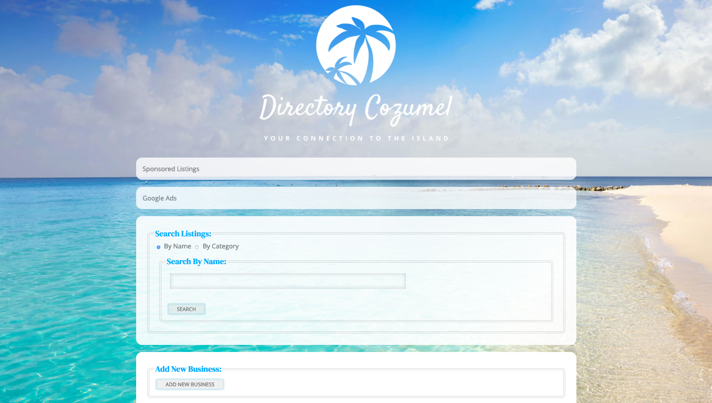
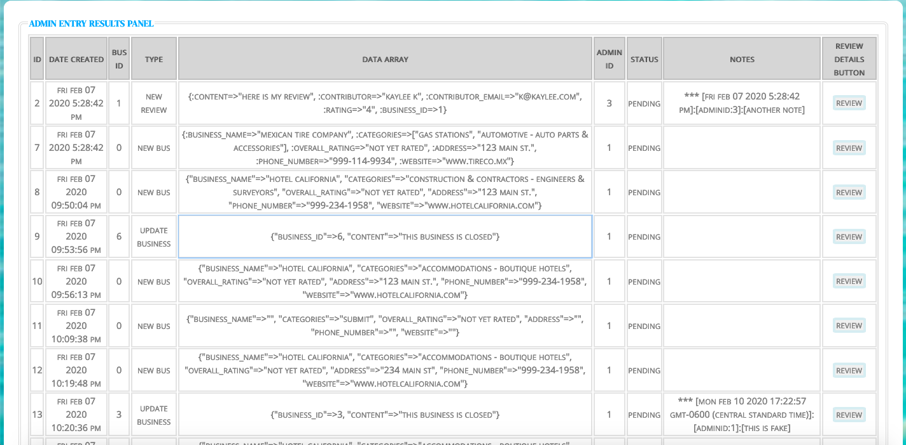
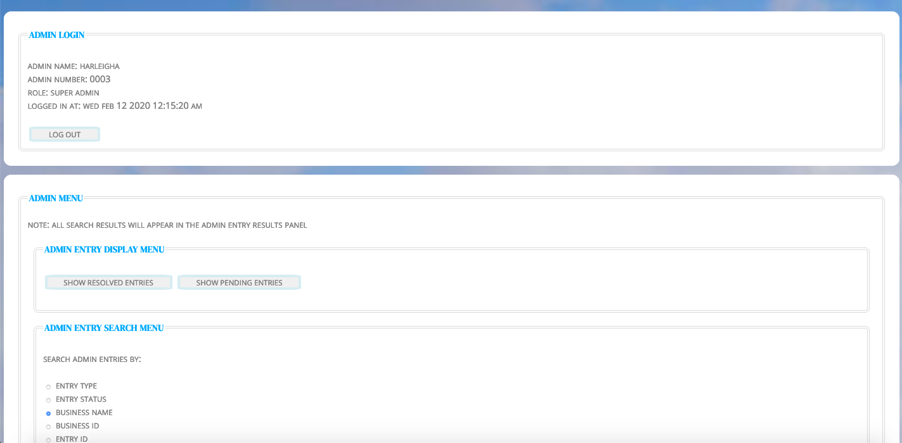
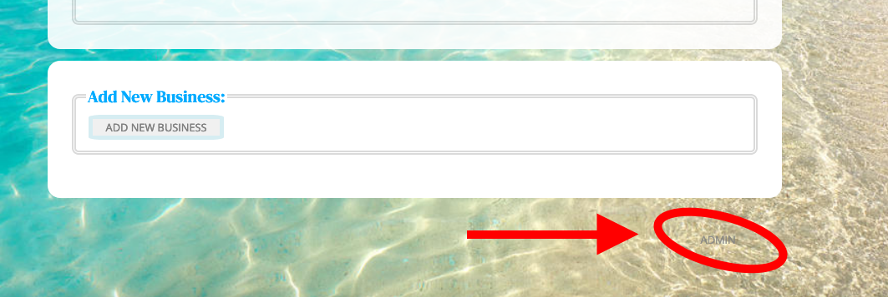

# Directory Cozumel Application

#### User Interface Screenshot 1

#### Admin Interface Screenshot 1

#### User Interface Screenshot 2

Directory Cozumel is mobile friendly web directory created to help users locate business and services in the area quickly and easily. Users can choose to search Directory Cozumel for their favorite businesses by searching the directory by business NAME or business CATEGORY. Once the user submits their search request the application will return a list of businesses matching the users request. The user can then select which business it would like to review detailed information about by clicking on the button displaying the business name which will return a complete business listing displaying name, rating, address, phone number, website, location map, and any related images or reviews left by other users.

Users can also add their own reviews, and images or flag or suggest edits for existing business listings. Below the search menu users can add new business to the directory by pressing the add new business button.

All user supplied data is sent to an admin entry database for review and verification before being add to the directory.

The application includes a built-in admin page which displays entries for all user initiated records.  From the Admin panels an administrator can approve and decline these entries, search and view entry records, initiate google maps creation for specified listings, add, create and delete administrators, and database records.

## How to Use this Application
### For Users
###### **Search Functions**

Search By Name - Select 'Search By Name' with search menu radio button and enter business name to search, click on 'Search' button to execute search

Search By Category - Select 'Search By Category' with search menu radio button and select category from drop down list, click on 'Search' button to execute search

###### **Adding New Business Listings**

To add a new business to the directory click on the 'Add New Business' button in the 'Add New Business' menu. Complete the 'Add Business' form by filling out the 'Name', 'Address', 'Phone Number' and 'Website' fields, and selecting the appropriate 'Category' from the drop down menu provided. If an appropriate category is not provided please use the 'Other' category.
###### **Adding Reviews / Adding Images / Suggesting Updates / Flagging Listings**

Once a business listing has been selected through the 'Search Listings' menu users can add reviews, images, suggest updates, and flag listings by filling out the appropriate forms. Email addresses are requested for listing verification purposes only and will remain anonymous, and will not be published or shared whatsoever.

When users have filled out the appropriate form, they can press the submit button to submit their contribution.

Once a user contribution has been made an entry is created in the admin database for review, where the quality and content of the data is reviewed and verified by admin before it approved and the new material is added to the database.

Upon successful submission of user content the following message will be displayed: 'Successfully submitted for Review!'

NOTE ABOUT IMAGES: In order to keep this app free to use we do not store images in our database. When saving image you will be asked for a URL, we encourage you to use one of the many popular photo sharing sites such as - USE - IMGUR - PHOTOBUCKET - FLICKR to store your images and copy the URL to share them here.
### For Admins

###### **Discrete Admin Button**

In the button right corner of the application below the 'Add New Business' panel is a discrete ADMIN button. Clicking on the text partially transparent text word 'ADMIN' will reveal the word is in fact a button that will reveal the 'Admin Login' panel.

###### **Admin Types**

There are two types of Admin Roles available one for basic admin referred to simply as 'admin' and elevated admin access referred to as 'Super' or Super Admin. Basic admin access allows administrators to view all pending and resolved entries for new business listings, reviews, or images with authorization to approve or decline pending entries which will initiate or prevent or user input persistence to the database, and to add admin notes to these entries. There is a search function in the main admin panel allowing admins to search ALL admin entries by type, status, business name, business id, entry id, contributor, or contributor email. Any authorization granted to basic admin are also available to administrators in the super admin role.

Super admins have the added privileges of being able to create, update, or delete, regular and super admin users, and a panel to create, update or delete database records of all types: ADMINS, ENTRIES, BUSINESSES, CATEGORIES, IMAGES, LISTINGS, MAPS, AND REVIEWS.

###### **Login**

Admins can enter the username and password provided to them by their Administrator, and click on the login button to login in the Admin Panel.

###### **Admin Info Panel**
The 'Admin Login' panel displays the username of the admin logged in, the administrators id number and time and date of current login.

The Admin panel info will display the admin id, login time, and role of the current admin user.

## Regular Admin Users
###### **Entry Index**
'Admin Display Entries' section of the 'Admin Menu ' panel contains the 'Show Resolved Entry Button' which will display all admin entries in the database.  The 'Show Pending Entries' button below it will display relevant entries awaiting review dependent on the admin role.  Regular admins will see a list of pending entries for NEW business listings, NEW Reviews, and NEW images. Super admins will see a complete list of pending entries for all new user input items as a regular admin would but additionally includes entries for flagged business listings and suggested entry updates.

###### **Entry Search**
Once again this panel includes a radio menu to select what entry property the admin would like to search for and an input box to enter the value the admin would like to search for. For example to search the entries database for all entries related to a business named 'Hotel California' the admin would use the radio button to select the Business Name value and enter the business name 'Hotel California' in the input box below. Any similar or matching results will be returned in the table below.

###### **Entry Details**
 In the admin entries table the final column will display a button labelled 'Review Details Button'. An administrator can click this button the reveal the values displayed in the index table plus additional details including business name, contributor, contributor email, and resolved date.  Below the entry details, the admin user will find button to return to 'Pending Index', 'Resolved Index', to 'Approve' or 'Reject' the record or to 'Add Notes' to the entry.

###### **Approve Entry**
From the detailed entry view when an admin has reviewed the entry details and verified that the data is valid and correct, the admin can persist this user generated object to the database by clicking on the 'Approve' button.  This will initiate a post request to the database to create and store the new directory item.  Additionally the entry record and detailed view will be updated to include the new 'approved' status value, the resolved date and time, and the number of the admin that handled the entry. At this point an admin can still add notes to the detailed entry, review the entry details, and return to the entry index but the option to 'approve' or 'decline' entries once they have been resolved is no longer available.

###### **Decline Entry**
The second option for resolving admin entries is decline them, if for some reason a record is deemed unsuitable to be persisted to the database, whether the record is inaccurate, a duplicate, or irrelevant to the directory, the admin will use the 'decline' button to resolve this entry.  Again the entry record and detailed view will be updated to include the now 'declined' status value, the resolved date and time, and the number of the admin that handled the entry and option to decline or approve this resolved entry will be unavailable but the functionality to add notes remains.

###### **Add Notes**
To add notes click the 'Add Notes' button from the detailed entry view and fill in the Notes input field and click 'Submit' will add add a not record to the entry that includes the admin id, and date and time note was created, and add it to the entry database record.

###### **Nav Buttons**

Nav Buttons include 'index resolved', index pending' buttons that return admin users to the main admin entries index.
Logout

Clicking the logout button will, log the admin out the admin panel and display the business directory.

## Super Admin Users

The super admin menu includes a panel for admin user creation, updating or deleting and a second panel for access to edit, update, or delete any/all database records. The 'Toggle Super Admin Menu' button will open the Super Admin Panel to reveal 'Admin Authorizations', and option to Create, Update and Delete any database record.

###### **Admin Create and Role Delegation**

Super admin can create, update or delete other admins and their roles through the 'Admin Authorization Panel'.

###### **To Create Admin**
For an administrator with Super Admin privileges a new admin can be created and authorized by use on the 'Create Admin' button which will display the form to input new admin username, password and roles.  Once the admin inputs the relevant data clicking the submit button will initiate the creation of a new admin and persist this request to the database.  The option to chose between regular and super admin must be declared at this time but can be updated by a super admin at any point afterward.

###### **To Update Admin**
To update an existing admin the admin user must been logged in with super admin privileges. Updates can be performed by clicking on the 'Update Admin' button in the 'Super Admin Menu' and inputing the admin username or id in the text field that appears and pressing the submit button. From there an auto generated form will appear displaying the admin properties and values for the requested admin instance, edit the values and desired and click on the save button to persist these records to the database.

###### **To Delete Admin**
To delete and admin click on the delete admin button in the super admin menu, again this action can only be performed by a super admin user.  When the text field appears enter the admin username or id to delete and confirm delete once the alert window appears.  Note that deleting an admin user will not edit or remove references to the admin in the entry records only prevent the admin from logging in to handle further entry, and or database records.

###### **Database Record Creation**
To create a new Record select the 'Create' radio button value, select the desired record type you would like to create and select the appropriate radio button, then click on the 'Submit' button.  A from specific to the type pf record you would like to create will appear, enter the appropriate values and click on the 'Submit' button below it.

###### **Database Record Update**
Using the 'Super Admin' menu panel an admin user can update any record by selecting the 'Update' radio value and selecting the record type. Once the super admin clicks on submit a text field will appear to enter the id or name associated with the record to update. Once the admin submits this query the record matching this query will be returned in a form displaying existing values for the record. Update the desired fields and click the submit button to persist changes to the database record.

###### **Record Deletion**
An Admin can delete a record from the database by selecting the 'Delete' radio value and the radio button for the desired record type.  Records with associated instances may require extra confirmation and will remove any associated records with it. Category records are a special case and can not be deleted until businesses associated with that category have been reassigned.

###### **Managing Google Maps**
As this stage in the application development google maps must be added manually to business listings through the Super Admin Panel.  Maps can be added to their appropriate business listings by selecting the radio button with a 'Create'
value and the 'Maps' radio value and clicking the submit button. This action will reveal a form for new map creation where the values of latitude, longitude and business id must be provided to initiate the creation and persistence of a new google map to the database.  Like all other objects in the database these values can be altered and updated with the same super admin menu.

## Getting Started

Download from GitHub repo and install on local server, run migrations, and seed database for application testing. For production use, clone repo, deploy to server, comment out all but the category seeds, run migration, seed database. Search Listings

## Prerequisites

Web Browser - Firefox, Safari, Google Chrome

This application was made with and optimized for Firefox (Developer Edition)

## Installing

To install this program locally:

	Clone repo and download locally to your computer
	From command line open backend api folder:
		cd directory_cozumel/directory-cozumel-backend-api/
	Run bundle install
	Run rake db:migrate
	Run rake db:seed
	Start server
		rails s
	Open app in Browser - open /directory_cozumel/frontend/index.html in browser
	App is ready to use

To Use Admin Functions:

	Press discrete admin button in the bottom right hand of the user panel
	For initial admin log in use default username: admin1 and default password: admin1
	Immediately update admin password to a new secret password

#### Location of Discrete Admin Button

## Built With:
<ul>
	<li> html5
	<li> css3
	<li> javascript ES6
	<li> jquery 3.4.1
	<li> rails ~> 5.2.3
	<li> ruby '2.3.3'
	<li> sqlite3
	<li> knock
	<li> jws
	<li> bcrypt ~> 3.1.7
	<li> byebug
	<li> bootsnap
	<li> listen
	<li> pry
	<li> puma 3.12.2
	<li> rack 2.0.8
	<li> rack-cors
	<li> spring '3.0.5'
	<li> google maps api
</ul>

## Release History

0.1.0
The first proper release

0.0.1
Work in progress

## Authors

Harleigh Abel - atxrenegade - harleighabel@gmail.com https://www.linkedin.com/in/harleigh-abel-8aaa1a64/

## License

Distributed under the GNU GENERAL PUBLIC LICENSE license. See https://gist.github.com/fny/4677598 for more information.
Acknowledgments: Photograph by NAME HERE

## Contributing
<ul>
	<li>Fork it (https://github.com/atxrenegade/directory_cozumel/fork) 
	<li>Create your feature branch (git checkout -b feature/fooBar) 
	<li>Commit your changes (git commit -am 'Add some fooBar') 
	<li>Push to the branch (git push origin feature/fooBar) 
	<li>Create a new Pull Request 
<ul>
